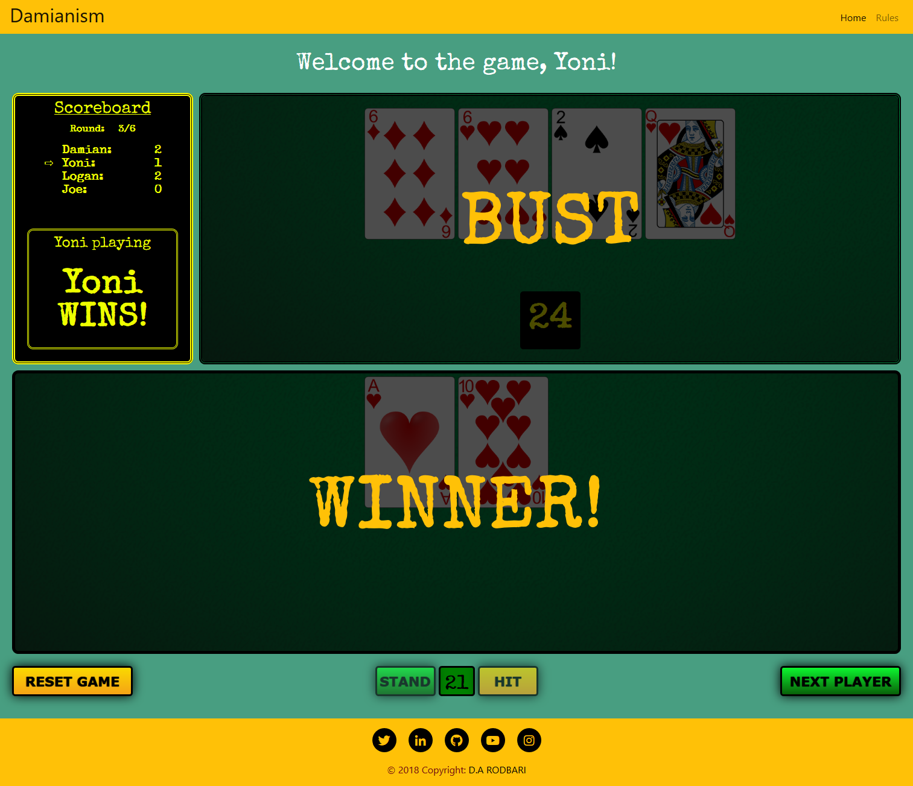
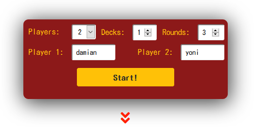
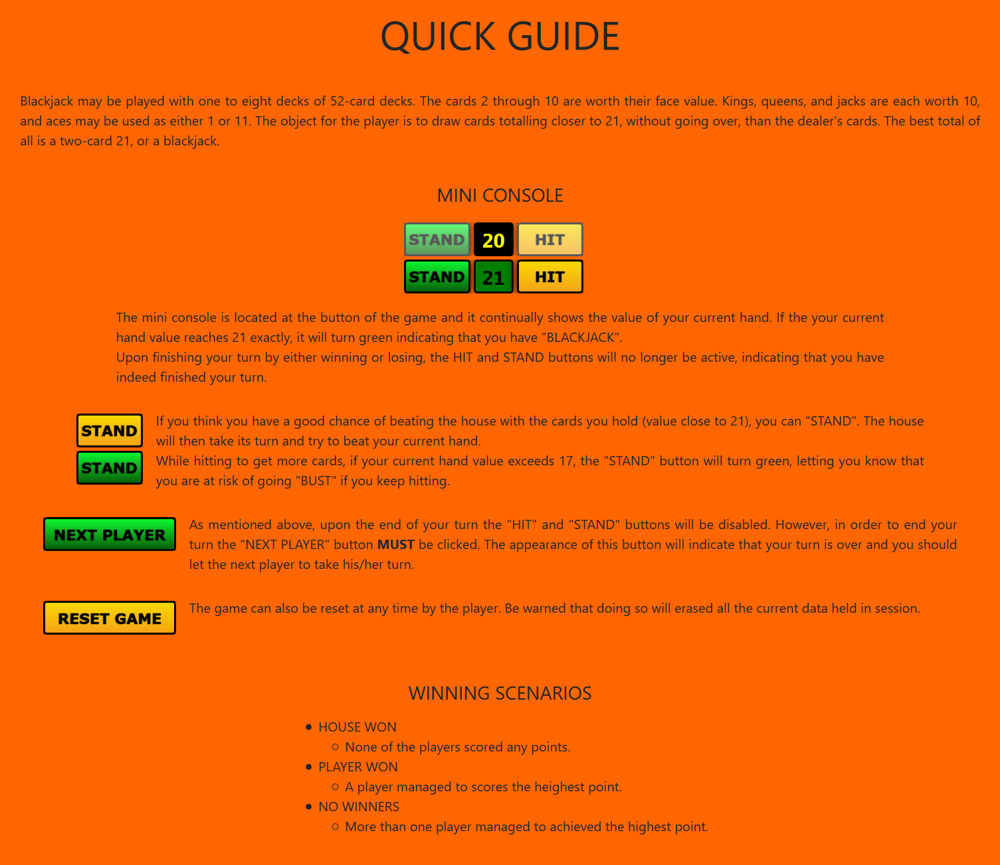
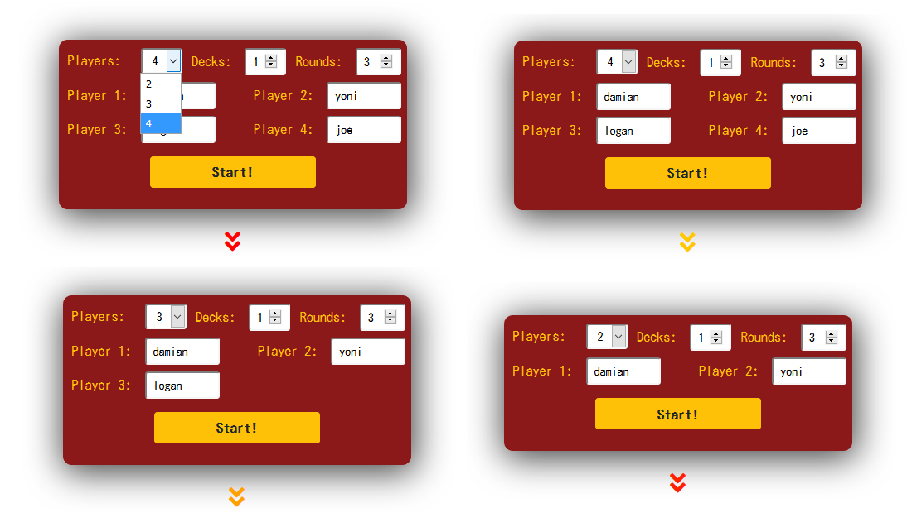
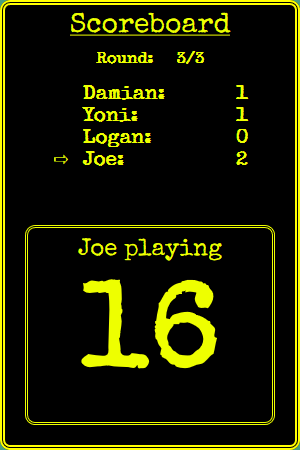
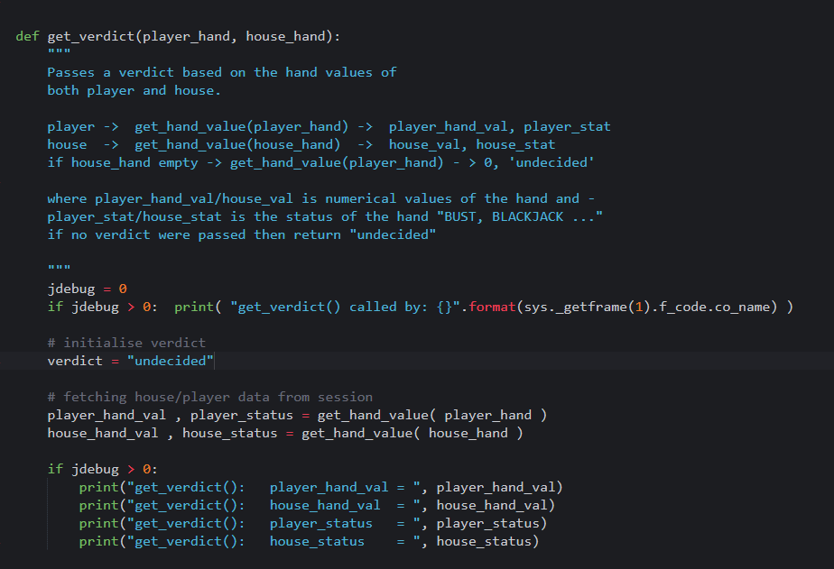
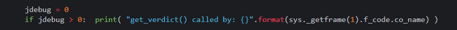

BLACKJACK
=========

### Aim

This is a recreation of the popular card game called “BLACKJACK”. The logic of
the game is written primarily in Python and managed by Flask microframework
Python module. The game’s aesthetics were completed using the conventional HTML/
CSS technologies, the complete list of which is given
[here](#technologies-used).

For the complete project approach please click [here](#_Project_approach).

### What it does

The game is entirely based on points rather than actual money. Players will take
turns to play against the house. If the player wins, he/she will be awarded a
point, otherwise the next player in line will take his/her turn. The scores can
be tracked live on the dedicated scoreboard. By the end of the final round, the
scores are counted and the player with the highest score will be declared as the
winner.

In order to win, players take turns to beat the house by getting a hand value
closer or equal to 21. At the start of the game each player is dealt two cards.
Based on the value of those cards, the player can then request more cards by
pressing “HIT” to achieve a hand value closer to 21 (BLACKJACK). The player will
lose if his/her hand value exceeds 21, commonly referred to as “BUST”. If both
house and the player get BLACKJACK then a “PUSH” event has occurred which is
equivalent of a DRAW outcome in which the player is not awarded any points.

EXTERNAL SOURCE:    For full guide on BLACKJACK rules please click
[here](https://en.wikipedia.org/wiki/Blackjack).

Features
========

The image above shows the options that are available to the user BEFORE the game
starts. These features or options, will define the game itself in terms of its
duration and difficulty. There are more features to explore while the game is in
session, which will be discussed further down within this section and in detail
within the “Project Approach” section.

The features are briefly covered within the website as well.

### Point system

Your average BLACKJACK game is currency based. However, in this version of the
game, the winning players are rewarded with a point for every win against the
house. Depending on the number of rounds set by the user, at the final round,
the player with the highest points will be declared the winner.

### Decks

The game can be played with up to 5 decks, each deck holding 52 cards.
Increasing the number of decks will make card counting more difficult.

### Players

The number of players can be dynamically changed.

Up to 4 players (2 by default) can play against the house at the same time. Each
player will take a turn to play against the house, regardless of the outcome,
win or lose, the next player will start its turn as soon as the current ends its
turn.

### Rounds

Rounds refer to the number of times the game has to cycle through all the
players to take their turns each. One full cycle in which all the players have
taken their turns, is referred to as one “round”. Increasing the number of
rounds will inevitably increase the duration of the game. There is no limit on
the rounds, it could be set to any integer greater than 2. The current round is
displayed on the scoreboard.

### House

House is the entity all the players play against. Depending on the number of
decks selected by the user (1-5), it creates the deck. It is also in charge of
dealing cards to the players ( house.deal() ) and resetting the deck (
house.reset() ).

### Scoreboard

Dynamically shows the points the players have scored so far. It also shows whose
turn it is to play both visually (an arrow) and textually, the current hand
value of the player and the how the number of rounds left to play. The user can
keep track of its hand value via the mini counter located within the player
console as well.

### Player console

Upon finishing your turn by either winning or losing, the HIT and STAND buttons
will no longer be active, indicating that you have indeed finished your turn.

##### HIT

Every time the HIT button is clicked, HOUSE will deal a card to the player. The
player must be aware of the risk of going BUST (over 21).

##### STAND

If you think you have a good chance of beating the house with the cards you
currently hold (value close to 21), you can "STAND". The house will then take
its turn and try to beat your current hand.

If your current hand value exceeds 17, the "STAND" button will turn green,
letting you know that you are at risk of going "BUST" if you keep hitting.

##### MINI COUNTER

Located between the HIT and STAND buttons at the bottom of the game, it
continually shows the current value of your hand. If your current hand value
reaches 21 exactly, it will turn green indicating that you have "BLACKJACK".

##### NEXT PLAYER

As mentioned above, upon the end of your turn the "HIT" and "STAND" buttons will
be disabled. However, in order to end your turn, the "NEXT PLAYER" button MUST
be clicked. The appearance of this button will indicate that your turn is over
and you should let the next player to take its turn.

##### RESET GAME

The game can also be reset at any time by the player. Be warned that doing so
will erased all the current data held in session.

Technologies Used
=================

1.  [Python](https://www.python.org/downloads/) v3.4.3

    -   [FLASK](http://flask.pocoo.org/) v1.0.2

    -   Unittest module for Test Driven Development

2.  JavaScript and [jQuery](https://jquery.com/) v3.3.1

    -   Debugging

    -   Smooth scroll applied to all links.

    -   Disabling the “ENTER” key on the index page form.

    -   Conversion of Flask template variables to JavaScript variables.

    -   Dynamically increase/decrease the number of text inputs for players
        based on selection.

    -   Player rotation functionalities

        -   Disable/Enable “HIT” and “STAND” buttons.

        -   Display/Hide “NEXT PLAYER” button.

        -   Apply theming of the “STAND” button.

        -   Apply theming to the mini counter.

3.  [SASS](https://sass-lang.com/)

    -   Adopted main method of styling. Used with combination of SASS variables,
        mixins and functions in total of 8 scss files.

4.  HTML5

5.  CSS

    -   Used with SASS.

6.  Flexbox

    -   Primary tool for centring item.

    -   Primary layout tool.

7.  [Bootstrap](https://getbootstrap.com/docs/4.0/getting-started/introduction/)
    v4.0

    -   Used for general aesthetics of a few item.

    -   Collapsible Navigation bar

    -   Responsive design the home page.

8.  [Font Awesome](https://fontawesome.com/) v5.0.13

    -   Footer icons

    -   Link to quick guide icon.

9.  [Google fonts](https://fonts.google.com/)

    -   Two fonts used in total

        -   [Special
            Elite](https://fonts.google.com/specimen/Special+Elite?selection.family=Special+Elite)
            – applied to the game page and scoreboard.

        -   [Kosugi](https://fonts.google.com/specimen/Kosugi) – applied the
            index page and everything else.

10. [Gimp](https://www.gimp.org/)

    -   Rescale background images – created two sets of images to be used on
        multiple devices with different screen resolutions.

    -   Card PNGs, rescaled and transparency applied using the “colour to alpha”
        feature.

11. Microsoft Word

    -   To write up the content of the README.md file before deployment.

12. Chrome and Firefox developer tools

    -   Used extensively for live-testing and running numerous different tasks.
        To name a few:

        -   Testing JavaScript functions.

        -   Individual elements loading times.

        -   Website/grid responsiveness.

        -   Element Colours, style, opacity and etc.

        -   Aligning and centring.

        -   Attribute value search.

        -   Fluidity and core functionality of the website.

13. [Git/Github](https://github.com/damianism)

    -   Kept track of the project’s evolution with frequent commits and
        informative messages.

    -   Secondary platform for deployment.

    -   GitHub was also used to access bootstrap’s source code.

14. [Heroku](https://www.heroku.com/)

    -   Used to as the primary deployment platform.

15. Cloud9

    -   Used as the main editor.

Content and File Management
===========================

The file management has been split into three sections all together. As a Flask
requirement, everything that is considered to be static should be placed inside
the static folder. Also, the templates MUST be placed inside the templates
folder.

### Static

-   Scss – SASS files

    -   mixins.scss – houses all the mixins and functions

    -   base.scss – targets the base elements such as footer and navbar.

    -   colors.scss – a collection of all colours to be used throughout the
        project.

    -   elements.scss – responsible for all the elements, buttons, house and …

    -   main.scss – complies all the scss files together, also addresses
        induvial wrappers.

    -   mediaQ.scss – media query for small screens

    -   animations.scss – animation for the link to quick guide

-   css – contains the converted SASS file

-   img – houses all the images used throughout the project

    -   extras – houses all the images to be used on the markdown file, such
        wireframe, logic basis and so on.

    -   Cards – houses the all the cards in a typical deck, and a back face.

    -   Guide – includes all the images in the quick guide section.

    -   Theming – includes all the images used to theme the website such as
        background images for the div in the index page.

-   js – JavaScript files

    -   main.js – script that’s applied globally (base template).

    -   game.js – used with the game page only.

-   Vendors

    -   Bootstrap

        -   css – CSS package supplied by vendor (bootstrap).

        -   js – JavaScript package supplied by vendor(bootstrap).

### Templates

-   base.html – used at the main template for the other views to expand on.

-   game.html – where the actual game takes place.

-   index.html – initial landing page which fetches user(s) data through a form.

-   winner.html – the page at which the final winner (if there is any) is
    declared.

### Other

-   app.py – main file to be included in the Proc file.

-   game.py – houses most of the logic (functions) for the game.

-   deck.py – houses the deck class which is responsible for the creation of the
    deck, dealing and etc.

-   test_app.py – Test Driven Development file

-   Procfile

-   Readme.md

-   Requirements.txt

Testing
=======

### Logic Debugging

All the core functions within the game.py are equipped with a debugging
mechanism that is enabled from within the function itself, which can be clearly
seen in the image above. This method of debugging is fast, efficient and
prevents spams of prints.

Furthermore, the “sys._getframe(1).f_code.co_name” part of the debugging
mechanism in the functions, can show exactly which part of the code this
particular function was called from which as you can imagine will be incredibly
beneficial when it comes to debugging and testing.

### Test Driven development 

The practicality of all critical functions within the game.py file was tested
via the Python “unittest” module. This module came in very handy in resolving a
number of unforeseen problems throughout the project. These automated tets can
be found in the
[test_app.py](https://github.com/damianism/blackjack/blob/master/test_app.py)
file.

### Defensive design and Bugs

-   Aliasing issues with session

    -   I was unable to add one of my local variables (scores) into the session.
        Later on, I discovered that this particular problem in known as
        “Aliasing”, and it was finally resolved by taking extra steps of taking
        the data out of the session as a local variable first, then making
        appropriate changes such add more data to it, and then putting back into
        the session as a variable.

-   Repetition with the player names

    -   Having the same name entered multiple times was causing weird effects of
        adding the same score to multiple players and turns being skipped. This
        issue was later resolved by validating the form through the python logic
        and Flask flash() function.

-   “ENTER” key on the index form

    -   The form on the index page that fetches all the initial data from the
        user could be submitted prematurely by pressing “ENTER” on one of the
        text inputs. This issue was resolved purely with JavaScript in the
        [main.js](https://github.com/damianism/blackjack/blob/master/static/js/main.js)
        script.

-   Player rotation and turn ending

    -   After a player finished its turn or went bust, the hit button was still
        functional allowing the player to keep pulling cards even though BUST
        status was raised and game had ended. Player could Simply ignore the
        “NEXT PLAYER” button and keep pulling cards. This issue was solved by
        disabling the “HIT” and “STAND” buttons within the player console, which
        was again achieved through JavaScript
        ([game.js](https://github.com/damianism/blackjack/blob/master/static/js/game.js)).

-   Conversion of the Flask template variables to JavaScript variables

    -   In order to get the previous task (Player rotation and turn ending) to
        work, I had to look for a way to use Flask template variables within the
        JavaScript file or script section of the html file. This issue was
        eventually resolved and can be viewed at the end of the
        [game.html](https://github.com/damianism/blackjack/blob/master/templates/game.html)
        file within the script section.

-   “NEXT PLAYER” button issues

    -   On the early version of the website, the “NEXT PLAYER” but was being
        enabled and disabled the way STAND and HIT buttons were, but
        unfortunately it was that clear to the user as it didn’t stand out as
        much, even though the colour and other properties on the button was
        changing. This issue was resolved by changing the display property of
        the “NEXT PLAYER” button and controlling its visibility.

-   Session fall backs

    -   On the early versions of the website, the player could easily skip the
        initial phase of submitting information and jump to the game or even the
        winners page. This issue was causing a serious problem as it could
        simply break the functionality of the game by skipping certain vital
        stages or by swapping back and forth between pages. This issue was
        resolved by adding fullbacks, which redirected the user onto the
        appropriate page. The players can still attempt to jump just straight to
        the game page or the winners page but they will be redirected back to
        index page where the player names and other data have to be entered
        before they can progress to the next round.

-   Session “KeyError”

    -   As mentioned in the previous bullet point, to restrict the user from
        doing certain tasks on the website, I had to put a couple of fall backs
        in place, However, I was repeatedly faced with a “KeyError” which was
        not expected at that level. After a while I realised I was dealing with
        two different situations at which the “KeyError” was occurring. This
        issue was later resolved by introducing a try and except statements.
        Even though this worked perfectly without any repercussions, I was still
        doubtful that it could run at the pace as before, since it was making
        the check every time the page was viewed. But having carried out tests
        extensively on different platforms, I concluded that the loading time of
        the page was not affected by the extra check in place and the solution
        has worked.

-   Refreshing manually using browser button

    -   Refreshing the page while the game is in session on the game page might
        affect the player rotation, hand values and final verdict visually on
        the screen (I believe the data within the session is still intact).
        These effects seem to be random and I haven’t been able to find a way
        around this issue yet.

### Responsiveness/Aesthetics/Functionality Testing

The responsiveness, functionality, fluidity of each page was extensively and
virtually tested on all the Chrome/Firefox responsive tool’s available devices,
ranging from Amazon fire tablets to iPhone x. Additionally, every page was
numerously loaded on the following devices by various users in order to identify
possible malfunctions and misbehaving elements.

-   iPhone x

-   Google Pixel 2

-   iPhone 7 Plus

-   Nexus 6P

-   22inch Full HD 1080p monitor

-   25inch Quad HD 1440p screen

-   13inch Full HD screen of a Dell XPS Ultrabook

-   15inch HD screen of a Dell Precision M4600

##### Browsers

The following browsers were used to test the final version of the website with.

-   Opera Version 54.0.2952.71 (64-bit)

-   Firefox Version 61.0.2 (64-bit)

-   Chrome Version 68.0.3440.106 (Official Build) (64-bit)

-   Chrome Mobile on Android Pie

-   Chrome Mobile on Android Oreo

-   Firefox Mobile on Android Pie

-   Safari Mobile iOS 11
